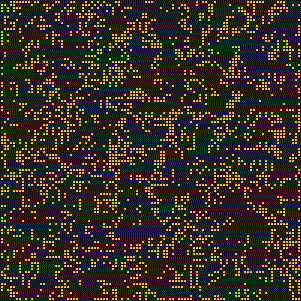
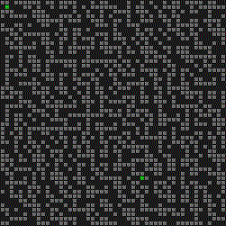
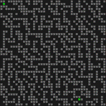

# Advent of Code

This repository contains my own solutions to the [Advent of
Code](https://adventofcode.com/) coding puzzles.

**Spoiler alert!**

If you don't want those puzzles spoiled for you, don't look at the code!
It runs on Python 3.10+.

## Requirements

The puzzle-solving code is all purely Python Standard Library stuff. The only
external dependencies are optional:

- `rich`, for pretty printing on the console, and
- `pillow`, for rendering visualisations.

## Usage

Execute `advent.py` at the top-level of the repository, with the year and day
number.

```
./advent.py 2023 9
```

You can give the `-t/--test` argument to run the test case from the puzzle
explanation instead of the actual puzzle, `-v/--verbose` to enable debug
logging, or `-d/--draw` to output a visualisation (if the puzzle code supports
that).

## Visualisations

Here's a sample of some of the visualisations I generated for these puzzles:

### 2015 Day 18, part 1 "Like a GIF For Your Yard"



### 2016 Day 8 "Two-Factor Authentication"


### 2016 Day 13, part 1 "A Maze of Twisty Little Cubicles"

 

Using Breadth-first search (left) and A Star (right) to solve the maze.
