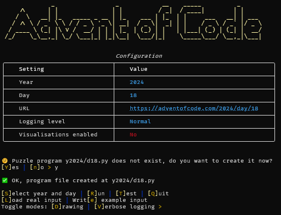
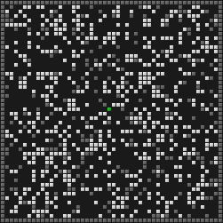
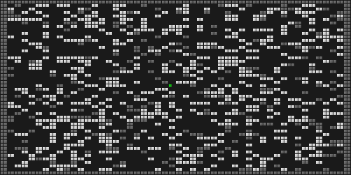

# Advent of Code

This repository contains my own solutions to the [Advent of
Code](https://adventofcode.com/) coding puzzles.

**Spoiler alert!**

If you don't want those puzzles spoiled for you, don't look at the code!

## Dependencies

It runs on Python 3.10+.

The puzzle-solving code is almost all purely Python Standard Library stuff. The only
required external dependency is `numpy`.

### Required dependencies

- `numpy`

### Optional dependencies

There are also some optional dependencies to enable extra features:

- `rich`, for pretty printing on the console
- `pillow`, for rendering visualisations
- `numba`, to speed up some of the number-crunchy solutions
- `pytest`, to run the test suite

## Installation

1. Clone the repo
2. Change into the top-level repo directory
3. Execute `python3 -m venv .venv` to create a Python virtual environment
4. Execute `source .venv/bin/activate` to activate the virtual environment
5. Execute `pip install -r requirements.txt` to install all required and
   optional Python package dependencies

## Usage

To simply run the solution for a puzzle, execute `advent.py` at the top-level
of the repository, with the year and day number as positional arguments, for
example:

```
./advent.py 2023 9
```

You can give the `-t/--test` argument to run the test case from the puzzle
explanation instead of the actual puzzle, `-v/--verbose` to enable debug
logging, or `-d/--draw` to output a visualisation (if the puzzle code supports
that).

You can also run `./advent.py` without any arguments to enter an interactive
mode which looks like this:



In the interactive mode, you can set up a new puzzle solution module from a
template, add example inputs, download your actual inputs, toggle the
visualisation and logging modes and run your solution in real or testing mode.

The interactive mode uses hot module loading, so in most cases you can re-run
your solution after making changes without ever leaving interactive mode. The
exceptions are when you make changes in another module that is imported by the
solution, or you are changing functions that are under numba.jit compilation.
In those cases you will need to exit and restart the interactive mode.

## Visualisations

Here's a sample of some of the visualisations I generated for these puzzles:

### 2015 Day 18, part 1 "Like a GIF For Your Yard"


### 2016 Day 8 "Two-Factor Authentication"


### 2016 Day 13, part 1 "A Maze of Twisty Little Cubicles"

 

Using Breadth-first search (left) and A Star (right) to solve the maze.

### 2019 Day 15, "Oxygen System"


### 2024 Day 9, "Disk Fragmenter"


### 2024 Day 14, "Restroom Redoubt"


### 2024 Day 15, "Warehouse Woes"

 
